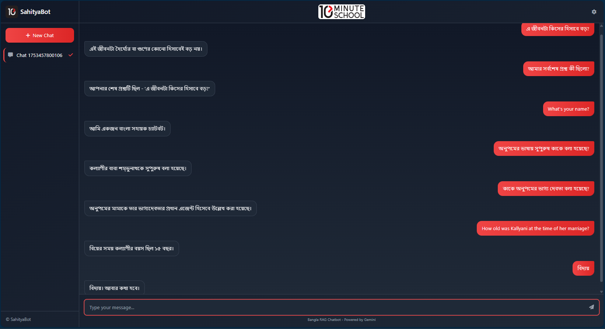

# সাহিত্যবট (SahityaBot)

This project implements a simple Multilingual Retrieval-Augmented Generation (RAG) system for answering queries in English and Bengali based on the HSC26 Bangla 1st Paper textbook's "অপরিচিতা" short story. The system extracts text from a PDF, preprocesses and chunks it, stores embeddings in a FAISS index, retrieves relevant chunks using semantic search, and generates answers using the Gemini 1.5 Flash model. A FastAPI-based REST API and a web interface enable user interaction, with evaluation metrics to assess performance.

## Demo Video 

[](https://youtu.be/Mb_3xnLxorU)

## Web UI Screenshot



## Project Overview

The RAG system:
- Accepts user queries in English and Bengali.
- Retrieves relevant document chunks from a vectorized knowledge base.
- Generates grounded answers using the retrieved context.
- Maintains short-term memory (recent chat history) and long-term memory (PDF corpus in FAISS).
- Includes a REST API and a web interface for interaction.
- Evaluates performance using groundedness and releverance metrics.

## Setup Guide

### Prerequisites
- **Python**: 3.8 or higher.
- **Tesseract OCR**: Install with Bengali language support.
  - **Ubuntu**: `sudo apt-get install tesseract-ocr tesseract-ocr-ben`
  - **Windows**: Download from [Tesseract GitHub](https://github.com/UB-Mannheim/tesseract/wiki) and add to PATH.
  - **macOS**: `brew install tesseract tesseract-lang`
- **Poppler**: For `pdf2image`.
  - **Ubuntu**: `sudo apt-get install poppler-utils`
  - **Windows**: Download from [Poppler for Windows](https://github.com/oschwartz10612/poppler-windows) and add to PATH.
  - **mac Sơn**: `brew install poppler`
- **Environment Variables**: Create a `.env` file in the project root with:
  ```
  GEMINI_API_KEY=your_gemini_api_key
  ```
### Installation
1. **Clone the Repository**:
   ```bash
   git clone https://github.com/SadabShiper/SahityaBot-10-MS-Assessment/
   cd SahityaBot-10-MS-Assessment
   ```

2. **Create a Virtual Environment**:
   ```bash
   python -m venv venv
   source venv/bin/activate  # On Windows: venv\Scripts\activate
   ```

3. **Install Dependencies**:
   ```bash
   pip install -r requirements.txt
   ```
   Ensure `requirements.txt` includes:
   ```
   pdf2image
   pillow
   pytesseract
   faiss-cpu 
   sentence-transformers
   google-generativeai
   nltk
   tqdm
   fastapi
   uvicorn
   python-multipart
   python-dotenv
   jinja2
   pandas
   scikit-learn
   ipykernel
   numpy
   transformers
   ```

4. **Set Up Environment Variables**:
   Create a `.env` file in the project root:
   ```bash
   echo "GEMINI_API_KEY=your_gemini_api_key" > .env
   ```

5. **Extract Text from PDF**:
   Place the `HSC26-Bangla1st-Paper.pdf` in the `Original PDF` directory. Run:
   ```bash
   python text_extraction.py
   ```
   This generates `output_bangla_pytesseract_300.txt` with extracted text.

6. **Run the Application**:
   ```bash
   python rag_chatbot.py
   ```
   The FastAPI server starts on `http://0.0.0.0:8000`. Access the web interface at `http://localhost:8000`.

### Directory Structure
```
bangla-rag-chatbot/
├── Original PDF/
│   └── HSC26-Bangla1st-Paper.pdf
├── static/
│   ├── 10minutelogo.png
│   └── 10_Minute_School_Logo.svg.png
├── templates/
│   └── index.html
├── output_bangla_pytesseract_300.txt
├── rag_chatbot.py
├── text_extraction.py
├── evaluation_report.py
├── evaluation_log.jsonl
├── evaluation_report.md
├── evaluation_report.html
├── .env
└── requirements.txt
```

## Tools, Libraries, and Packages
- **Text Extraction**: `pdf2image` (convert PDF to images), `pytesseract` (OCR for Bengali and English text).
- **Preprocessing**: `nltk` (sentence tokenization), `re` (text cleaning).
- **Embedding and Retrieval**: `sentence-transformers` (`paraphrase-multilingual-MiniLM-L12-v2` for embeddings, `cross-encoder/ms-marco-MiniLM-L-6-v2` for reranking), `faiss-cpu` (vector storage and search).
- **Generation**: `google-generativeai` (Gemini 2.5 Flash model).
- **API and Web Interface**: `fastapi`, `uvicorn`, `jinja2` (templating), `tailwindcss` (styling via CDN).
- **Evaluation**: `pandas` (data analysis), `sklearn` (cosine similarity).
- **Utilities**: `python-dotenv` (environment variables), `tqdm` (progress bars).

## Sample Queries and Outputs
Below are sample queries and their expected outputs based on the HSC26 Bangla 1st Paper content:

| Query (Bengali) | Expected Answer | Notes |
|-----------------------------------------------|-----------------|---------------------------|
| অনুপমের ভাষায় সুপুরুষ কাকে বলা হয়েছে? | শম্ভুনাথ | Retrieved from relevant chunk. |
| কাকে অনুপমের ভাগ্য দেবতা বলে উল্লেখ করা হয়েছে? | মামাকে | Context accurately matched. |
| বিয়ের সময় কল্যাণীর প্রকৃত বয়স কত ছিল? | ১৫ বছর | Precise answer from text. |

**English Query Example**:
- **Query**: Who is referred to as the "gentleman" in Anupam's words?
- **Answer**: Shumbhunath

## API Documentation
The system provides a REST API via FastAPI for interaction with the RAG chatbot.

### Endpoints
1. **GET /**: Serves the web interface (`index.html`).
2. **POST /api/chat**:
   - **Request Body**:
     ```json
     {
       "session_id": "string",
       "message": "string"
     }
     ```
   - **Response**: Streaming text response with the chatbot’s answer.
   - **Description**: Accepts a user query and returns a generated answer, maintaining session history.
3. **GET /api/sessions**:
   - **Response**:
     ```json
     {"sessions": ["session-123", "session-456"]}
     ```
   - **Description**: Lists all active session IDs.
4. **GET /api/session/{session_id}**:
   - **Response**:
     ```json
     {"history": [{"user": "query", "bot": "answer"}]}
     ```
   - **Description**: Retrieves chat history for a specific session.
5. **GET /api/generate_report**:
   - **Response**:
     ```json
     {"status": "success", "files": ["evaluation_report.md", "evaluation_report.html"]}
     ```
   - **Description**: Generates evaluation reports in Markdown and HTML formats.
6. **GET /api/evaluation_report?format={json|html}**:
   - **Response**: JSON summary and detailed logs or HTML report.
   - **Description**: Returns evaluation metrics and interaction logs.

### Example API Usage
```bash
curl -X POST "http://localhost:8000/api/chat" \
-H "Content-Type: application/json" \
-d '{"session_id": "session-123", "message": "অনুপমের ভাষায় সুপুরুষ কাকে বলা হয়েছে?"}'
```

## Evaluation Matrix
The evaluation system (`evaluation_report.py`) logs interactions in `evaluation_log.jsonl` and generates reports with the following metrics:
- **Total Interactions**: Number of queries processed.
- **Average Groundedness**: Mean cosine similarity between answer and retrieved chunks.
- **Average Relevance**: Mean relevance score from `CrossEncoder`.
- **Combined Score**: Mean of groundedness and relevance scores.
- **Score Distributions**: Binned distributions (0.0-0.2, 0.2-0.4, etc.) for groundedness and relevance.
- **Top/Bottom Questions**: Top 3 and bottom 3 questions by combined score.

**Example Report Output** (from `evaluation_report.md`):
```markdown
# RAG System Evaluation Report
**Generated on**: 2025-07-25 22:55:00
**Total Interactions**: 10

## Overall Metrics
| Metric | Value |
|--------|-------|
| Average Groundedness | 0.750 |
| Average Relevance | 0.720 |
| Combined Score | 0.735 |

## Score Distributions
### Groundedness
- 0.0-0.2: 0 interactions
- 0.2-0.4: 1 interactions
- 0.4-0.6: 2 interactions
- 0.6-0.8: 5 interactions
- 0.8-1.0: 2 interactions

### Relevance
- 0.0-0.2: 0 interactions
- 0.2-0.4: 2 interactions
- 0.4-0.6: 3 interactions
- 0.6-0.8: 3 interactions
- 0.8-1.0: 2 interactions
```

## Answers to Must-Answer Questions

### 1. What method or library did you use to extract the text, and why? Did you face any formatting challenges with the PDF content?
- **Method/Library**: The text was extracted using `pdf2image` to convert PDF pages to images and `pytesseract` for Optical Character Recognition (OCR), with support for both Bengali and English (`lang="ben+eng"`). The PDF (`HSC26-Bangla1st-Paper.pdf`) was processed at 300 DPI to ensure high-quality text extraction.
- **Why Chosen**: `pytesseract` was selected for its robust support for Bengali script, which is essential for accurately extracting text from the HSC26 Bangla 1st Paper. Other libraries, such as `PyMuPDF`, `PyPDF2`, and `pdfplumber`, were tested but produced illegible Bengali text due to the PDF’s non-Unicode-compliant fonts and image-based content. `pytesseract` leverages Tesseract’s OCR capabilities, which handle Bengali’s complex conjunct characters (ligatures) effectively when paired with high-quality images. The 300 DPI resolution was chosen to balance text clarity and processing efficiency, ensuring reliable OCR output.
- **Formatting Challenges**:
  - **Character Recognition Errors**: Bengali’s conjunct characters and font variations led to occasional OCR misrecognitions, such as incorrect glyphs or merged characters.
  - **Layout Issues**: The PDF’s multi-column layouts, headers, footers, and decorative elements caused jumbled text in the OCR output, disrupting sentence flow.
  - **Noise**: Extraneous elements like page numbers, watermarks, or graphical artifacts were included in the extracted text.
  - **Mitigation**: The `clean_text` function in `rag_chatbot.py` uses regex (`re.sub(r'[A-Za-z0-9~!@#$%^&*()_+=\[\]{}|\\:;"\'<>,./?-]', '', text)`) to remove non-Bengali characters, numbers, punctuation, and excessive whitespace, normalizing the text for downstream processing. Despite this, some OCR errors may persist due to image quality limitations, potentially affecting chunk accuracy. Using a higher DPI or an advanced OCR engine like Google Cloud Vision could further improve results but was not implemented due to setup complexity.

### 2. What chunking strategy did you choose (e.g., paragraph-based, sentence-based, character limit)? Why do you think it works well for semantic retrieval?
- **Strategy**: Sentence-based chunking with `nltk.sent_tokenize`, grouping 3 sentences per chunk with a stride of 1 (overlapping chunks), as implemented in `split_into_chunks`.
- **Why Chosen**:
  - **Semantic Coherence**: Three-sentence chunks provide enough context to capture meaningful semantic relationships, suitable for literary content like the HSC26 Bangla 1st Paper.
  - **Overlap (Stride=1)**: Overlapping chunks ensure that information spanning sentence boundaries is not lost, improving retrieval robustness.
  - **Alignment with Embedding Model**: The `paraphrase-multilingual-MiniLM-L12-v2` model performs well with small-to-medium text chunks, making sentence-based chunking ideal for semantic encoding.
- **Why It Works Well**: This strategy balances granularity and context, enabling precise retrieval for specific queries (e.g., “অনুপমের ভাষায় সুপুরুষ কাকে বলা হয়েছে?”). Overlap ensures that answers split across sentences (e.g., “শম্ভুনাথ” in context) are captured, and the chunk size aligns with the embedding model’s input capacity, enhancing semantic retrieval accuracy.

### 3. What embedding model did you use? Why did you choose it? How does it capture the meaning of the text?
- **Embedding Model**: `sentence-transformers/paraphrase-multilingual-MiniLM-L12-v2`.
- **Why Chosen**:
  - **Multilingual Support**: The model supports Bengali and English, crucial for handling bilingual queries and document content.
  - **Efficiency**: MiniLM is lightweight, offering a good balance of performance and computational efficiency for a small-scale project.
  - **Paraphrase Capability**: Trained on paraphrase datasets, it captures semantic similarity even when queries and document text are phrased differently.
- **How It Captures Meaning**: The model uses a transformer-based architecture to encode text into 384-dimensional dense vectors. It learns contextual relationships between words and sentences through pretraining on multilingual datasets, enabling it to map semantically similar texts (e.g., “সুপুরুষ” and “শম্ভুনাথ”) to close vectors. This ensures effective retrieval for both exact and paraphrased queries in Bengali and English.

### 4. How are you comparing the query with your stored chunks? Why did you choose this similarity method and storage setup?
- **Comparison Method**:
  - **Initial Retrieval**: FAISS with `IndexFlatIP` (Inner Product) retrieves the top-5 chunks based on cosine similarity (since embeddings are normalized).
  - **Reranking**: A `CrossEncoder` (`cross-encoder/ms-marco-MiniLM-L-6-v2`) scores query-chunk pairs to reorder them by relevance.
- **Storage Setup**: FAISS with an in-memory `IndexFlatIP` index stores chunk embeddings.
- **Why Chosen**:
  - **FAISS**: Efficient for similarity search in small-to-medium datasets. `IndexFlatIP` provides exact cosine similarity, suitable for your modest corpus size.
  - **CrossEncoder**: Enhances retrieval precision by jointly processing query-chunk pairs, capturing deeper semantic relationships missed by initial embedding-based search.
  - **Storage**: FAISS is lightweight, fast, and doesn’t require external database infrastructure, simplifying deployment compared to alternatives like Pinecone.
- **Rationale**: The two-stage approach (FAISS for coarse retrieval, CrossEncoder for fine reranking) balances speed and accuracy, ensuring relevant chunks are prioritized for answer generation.

### 5. How do you ensure that the question and the document chunks are compared meaningfully? What would happen if the query is vague or missing context?
- **Ensuring Meaningful Comparison**:
  - **High-Quality Embeddings**: The `paraphrase-multilingual-MiniLM-L12-v2` model generates robust embeddings that capture semantic meaning across languages.
  - **Reranking**: The `CrossEncoder` refines FAISS results, ensuring only the most relevant chunks are used.
  - **Prompt Engineering**: The `build_chat_prompt` function constructs a prompt with retrieved context, chat history, and instructions to ground answers in the provided information, preventing hallucination.
  - **Groundedness Check**: The `groundedness_score` function computes cosine similarity between the answer and retrieved chunks, rejecting answers below a 0.4 threshold with a fallback message (“দুঃখিত, প্রাসঙ্গিক তথ্যের মধ্যে উত্তর পাওয়া যায়নি।”).
- **Vague Queries**:
  - **Impact**: Vague queries (e.g., “সুপুরুষ কে?”) may retrieve less relevant chunks due to ambiguous semantics, leading to low groundedness scores.
  - **Outcome**: The system returns the fallback message if the answer isn’t grounded, avoiding incorrect responses but potentially reducing user satisfaction.
  - **Mitigation**: Improve handling by implementing query expansion, increasing `TOP_K`, or prompting users for clarification via the UI.

### 6. Do the results seem relevant? If not, what might improve them (e.g., better chunking, better embedding model, larger document)?
- **Relevance**:
  - Based on the evaluation system (`evaluation_report.py`), relevance is assessed via `CrossEncoder` scores and groundedness via cosine similarity. The sample queries (e.g., “অনুপমের ভাষায় সুপুরুষ কাকে বলা হয়েছে?” → “শম্ভুনাথ”) suggest high relevance when the corpus contains clear answers.
  - The system’s design (overlapping chunks, multilingual embeddings, reranking) ensures relevance for well-formed queries. However, OCR errors or incomplete corpus coverage could reduce relevance for some queries.
- **Potential Improvements**:
  - **Better Chunking**: Smaller chunks (e.g., 2 sentences) or dynamic chunking based on content density could improve precision for short, specific queries.
  - **Better Embedding Model**: A larger model like `sentence-transformers/paraphrase-mpnet-base-v2` could capture more nuanced semantics, though it’s computationally heavier.
  - **Larger Document**: Including additional relevant texts (e.g., related study guides) could provide more context for ambiguous queries.
  - **OCR Improvements**: Using a more advanced OCR engine (e.g., Google Cloud Vision) or manual text correction could reduce extraction errors.
  - **Query Rewriting**: Implementing an LLM-based query rephrasing step could handle vague queries better.
